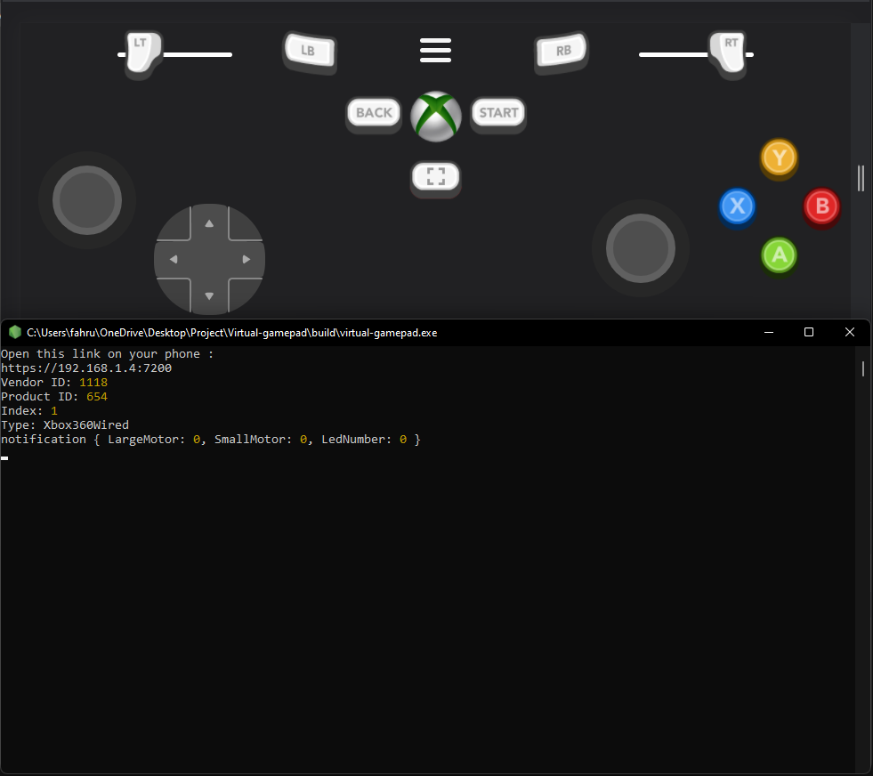
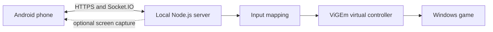

# Air Controller


Air Controller turns an Android phone into a wireless gamepad for a Windows PC. A local Node.js service hosts the controller interface, exchanges input over Socket.IO, and forwards controller state through ViGEm so compatible games see a virtual Xbox-style controller.



## How it works



## Repository layout

```text
src/node-server/  Express, Socket.IO, virtual-controller, and screen-capture service
src/webview/      Android WebView client
build/            Packaged historical builds
others/           Project screenshot
```

## Requirements

### Windows host

- Node.js 16 or newer and npm
- [ViGEmBus](https://github.com/ViGEm/ViGEmBus/releases)
- Python 3 and Visual Studio with the Desktop development with C++ workload when rebuilding native dependencies
- OpenSSL or another way to create a local certificate

### Android client

- Android Studio for source builds, or a compatible packaged APK
- Phone and computer connected to the same trusted network

## Run the host from source

```bash
git clone https://github.com/Arkane-o7/Air-Controller.git
cd Air-Controller/src/node-server
npm install
```

Create a self-signed certificate in `src/node-server/ssl/`, then start the service:

```bash
npm start
```

The terminal prints the local address the phone should open. Because the certificate is self-signed, the client may require an explicit trust step on first use.

## Build the Android client

1. Open `src/webview` as an existing project in Android Studio.
2. Let Gradle synchronize dependencies.
3. Build and install the debug or release APK.
4. Start the Windows host and enter its displayed URL in the Android app.
5. Select **Connect** and test the controls in a safe environment.

## Packaging the host

The Node package contains `pkg` metadata for a Windows x64 executable. Install a compatible `pkg` CLI and build from `src/node-server` using its `package.json` configuration.

## Security notes

- Run the service only on networks you trust.
- Treat locally generated TLS certificates as development credentials.
- Do not expose the controller port directly to the public internet.
- ViGEmBus and native Node modules are Windows-specific; other host operating systems are not currently supported.

## Project lineage

This repository preserves a virtual-gamepad implementation whose source metadata and historical links attribute the original project to [FahrulID/virtual-gamepad](https://github.com/FahrulID/virtual-gamepad). Keep that attribution intact when redistributing modified versions.

## License

Distributed under the MIT License. See [`LICENSE.txt`](LICENSE.txt).
